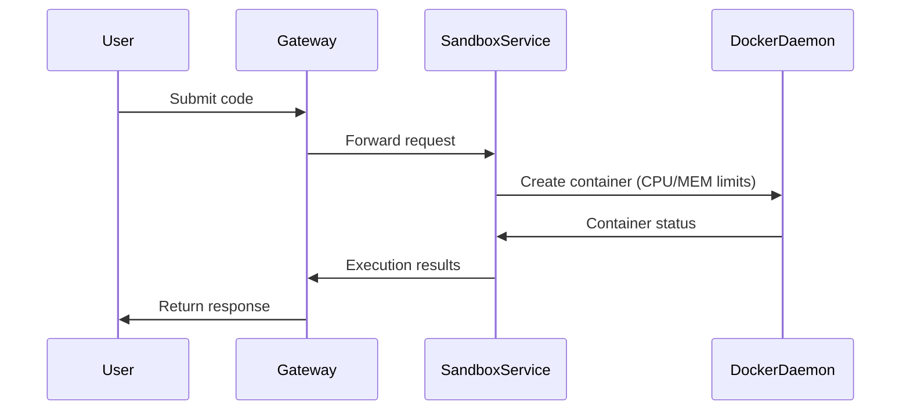

# D-OnlineJudge

[](https://www.oracle.com/java/technologies/javase-jdk17-downloads.html)  [](https://spring.io/projects/spring-boot)  [](https://spring.io/projects/spring-cloud)  [](https://spring.io/projects/spring-cloud-gateway)  [](https://github.com/OpenFeign/feign)  [](https://nacos.io/) [](https://www.mysql.com/)  [](https://baomidou.com/) [](https://vuejs.org/)  [](https://www.typescriptlang.org/)  [](https://element-plus.org/)  [](https://www.docker.com/) [](LICENSE)

**D-OnlineJudge** is a full-stack online coding platform featuring a Spring Cloud-based microservices architecture and Vue 3 frontend. It provides secure code execution environments through Docker containerization and robust inter-service communication via OpenFeign. The system supports programming competitions, code submission evaluation, and real-time progress tracking.

> Attention: This project is not yet fully completed; the problem list page, as well as the comparison of answers and user program output, are still under development, and due to the author's poor time management, no updates are expected in the near future.

---

## Project Structure

The project is organized into the following directories:

- **`DOJ-BE`**: Contains the backend code, consisting of multiple microservices.
- **`DOJ-FE`**: Contains the frontend code, built with Vue 3.
- **`docs`**: Contains additional project documentation.

---

## Technology Stack

### Backend (DOJ-BE)

The backend leverages a modern microservices architecture, ensuring scalability, efficiency, and security.

#### Framework
- **Spring Boot 2.7.12**  
  The core framework for building microservices with minimal configuration, featuring auto-configuration, embedded servers, and streamlined development.

#### Microservices and Cloud
- **Spring Cloud 2021.0.3**  
  Facilitates microservices management with service discovery, configuration management, and load balancing.
- **Spring Cloud Alibaba 2021.0.4.0**  
  Integrates Alibaba's microservices tools, primarily using Nacos for service registration and dynamic configuration.
- **Spring Cloud Gateway**  
  Acts as the API gateway, managing request routing, filtering, and load balancing for scalability.
- **Spring Cloud LoadBalancer**  
  Provides client-side load balancing for optimized inter-service communication.
- **Nacos**  
  Serves as the service registry and discovery center, also supporting dynamic configuration management.

#### Database and ORM
- **MySQL 8.0.23**  
  A relational database storing user data, problems, and submissions, optimized for high-concurrency queries.
- **MyBatis-Plus 3.5.2**  
  An ORM framework simplifying database operations with features like automatic CRUD, pagination, and dynamic SQL.

#### API Documentation and Validation
- **Knife4j 4.1.0**  
  An OpenAPI 2-based tool providing an intuitive interface for API documentation, testing, and debugging.
- **Spring Boot Starter Validation**  
  Ensures data integrity through request parameter validation.

#### Utility Libraries
- **Lombok 1.18.32**  
  Reduces boilerplate code with annotations like `@Getter` and `@Setter`.
- **Hutool 5.8.11**  
  A Java utility library offering tools for file operations, date handling, encryption, and more.

#### Sandbox and Code Execution
- **Docker** (Planned Integration)  
  Planned for isolated, secure code execution environments with resource limits.
- **JSch 0.1.55**  
  An SSH library, potentially used for managing remote Docker hosts.

#### Build and Development Tools
- **Maven**  
  Manages dependencies and the build process.
- **Java 17**  
  The runtime environment, leveraging modern features like record classes and sealed classes.
- **Spring Boot Starter Test**  
  Supports unit and integration testing.

---

### Frontend (DOJ-FE)

The frontend is built with the Vue 3 ecosystem, emphasizing user experience and development efficiency.

#### Framework
- **Vue 3**  
  A progressive JavaScript framework using the Composition API for reactive UI development.

#### Build Tool
- **Vite**  
  A fast frontend build tool with hot module replacement (HMR) and quick cold starts.

#### UI Component Library
- **Element Plus**  
  A Vue 3-compatible library offering components like buttons, forms, and tables.
- **@element-plus/icons-vue**  
  An icon library complementing Element Plus.

#### Code Editor
- **CodeMirror 6**  
  A versatile code editor with syntax highlighting for languages like C++, Java, Python, and JavaScript.

#### State Management
- **Pinia**  
  A lightweight Vue 3 state management library with modular design and devtools support.
- **pinia-plugin-persistedstate**  
  Persists state across page refreshes.

#### Routing
- **Vue Router**  
  Manages dynamic routing and page navigation for Vue 3.

#### Styling
- **SCSS**  
  A CSS preprocessor with variables, nesting, and mixins for reusable styles.
- **vite-plugin-svg-icons**  
  Optimizes SVG icon management by caching and dynamic loading.

#### Data Visualization
- **ECharts**  
  A library for rendering charts, such as problem pass rates and user statistics.

#### HTTP Client
- **Axios**  
  A lightweight HTTP client for backend communication, with interceptors and error handling.

#### Other
- **NProgress**  
  A progress bar enhancing the page-loading experience.
- **Cropper.js**  
  An image cropping tool for features like avatar uploads.
- **TypeScript**  
  Adds static typing for improved maintainability and developer experience.

---

## Key Technology Enhancements

### 1. Microservice Communication with OpenFeign
The backend implements declarative REST client communication between services using **Spring Cloud OpenFeign**:

```java
// 服务间调用示例
@FeignClient(name = "problem-service", path = "/api/problems")
public interface ProblemServiceClient {
    
    @GetMapping("/{problemId}")
    ProblemDTO getProblemById(@PathVariable Long problemId);

    @PostMapping("/{problemId}/submit")
    SubmissionResult submitSolution(
        @PathVariable Long problemId,
        @RequestBody CodeSubmission submission
    );
}
```

**Features**:
- Integrated with Spring Cloud LoadBalancer for client-side load balancing
- Hystrix fallback support for circuit breaking
- Request/response logging via custom interceptors
- Unified error handling with ErrorDecoder

---

### 2. Docker-based Code Execution Sandbox
Secure code execution is achieved through Docker container orchestration:

#### Sandbox Architecture

```mermaid
sequenceDiagram
    participant User
    participant Gateway
    participant SandboxService
    participant DockerDaemon
    
    User->>Gateway: Submit code
    Gateway->>SandboxService: Forward request
    SandboxService->>DockerDaemon: Create container (CPU/MEM limits)
    DockerDaemon->>SandboxService: Container status
    SandboxService->>Gateway: Execution results
    Gateway->>User: Return response
```

**Implementation Details**:
```java
// Docker 容器管理核心逻辑
public class DockerSandboxExecutor {
    
    private final DockerClient dockerClient;
    
    public ExecutionResult execute(CodeTask task) {
        try {
            // 1. 创建临时目录
            Path tempDir = createTempDirectory();
            
            // 2. 写入用户代码
            writeCodeToFile(tempDir, task.getCode());
            
            // 3. 构建Docker命令
            String[] cmd = buildDockerCommand(task.getLanguage());
            
            // 4. 创建容器配置
            HostConfig hostConfig = HostConfig.builder()
                .memory(task.getMemoryLimit() * 1024 * 1024L)
                .cpuPeriod(100000)
                .cpuQuota((int)(task.getCpuLimit() * 100000))
                .build();
            
            CreateContainerResponse container = dockerClient.createContainerCmd("sandbox-image")
                .withHostConfig(hostConfig)
                .withCmd(cmd)
                .exec();
                
            // 5. 启动并监控容器
            dockerClient.startContainerCmd(container.getId()).exec();
            waitForContainer(container.getId());
            
            // 6. 获取执行结果
            return parseResults(container.getId());
            
        } catch (DockerException e) {
            // 异常处理逻辑
        }
    }
}
```

**Security Measures**:
- Resource constraints via Docker cgroups (CPU/Memory limits)
- Read-only filesystem mounts
- Network namespace isolation
- User namespace remapping
- SELinux/AppArmor profiles
- Automated container cleanup

---

## Expanded Installation Guide

### Docker Setup for Sandbox
1. **Install Docker CE**:
```bash
# For Ubuntu
sudo apt-get update
sudo apt-get install docker-ce docker-ce-cli containerd.io
```

2. **Configure Remote API Access**:
```bash
# /etc/docker/daemon.json
{
  "hosts": ["unix:///var/run/docker.sock", "tcp://0.0.0.0:2375"],
  "icc": false,
  "userns-remap": "default",
  "default-ulimits": {
    "nproc": "1024:2048",
    "nofile": "100:200"
  }
}
```

3. **Build Sandbox Images**:
```dockerfile
# Python沙箱示例
FROM python:3.9-slim
RUN apt-get update && apt-get install -y time
WORKDIR /app
COPY security_policy.json /etc/
RUN chmod 555 /app && useradd -M sandbox-user
USER sandbox-user
```

---

## Running the Application

### Starting the Backend (DOJ-BE)
The backend comprises multiple microservices that must be started individually. Examples include:

- **Gateway Service**:
  ```bash
  cd DOJ-BE/gateway-service
  mvn spring-boot:run
  ```

- Start other services like `user-service`, `problem-service`, and `sandbox-service` similarly.


1. **Set Up MySQL Database**:
   - Create a database (e.g., `doj_db`).
   - Update connection details in `DOJ-BE/*/src/main/resources/application.yml`.

2. **Configure Nacos**:
   - Start Nacos server (see [Nacos Quickstart](https://nacos.io/en-us/docs/quick-start.html)).
   - Update Nacos address in `DOJ-BE/*/src/main/resources/bootstrap.yml`.

3. **Set Up Docker for Sandbox**:
   - Install Docker CE:
     ```bash
     sudo apt-get update
     sudo apt-get install docker-ce docker-ce-cli containerd.io
     ```
   - Configure Docker Daemon (`/etc/docker/daemon.json`):
     ```json
     {
       "hosts": ["unix:///var/run/docker.sock", "tcp://0.0.0.0:2375"],
       "icc": false,
       "userns-remap": "default",
       "default-ulimits": {
         "nproc": "1024:2048",
         "nofile": "100:200"
       }
     }
     ```
   - Build Sandbox Image (e.g., Python):
     ```dockerfile
     FROM python:3.9-slim
     RUN apt-get update && apt-get install -y time
     WORKDIR /app
     COPY security_policy.json /etc/
     RUN chmod 555 /app && useradd -M sandbox-user
     USER sandbox-user
     ```

### Starting the Frontend (DOJ-FE)
```bash
cd DOJ-FE
npm run dev
```
This launches the Vite development server, typically at `http://localhost:5173`.

---

## Monitoring & Maintenance

### Prometheus/Grafana Integration
```yaml
# 监控配置示例
management:
  endpoints:
    web:
      exposure:
        include: health,metrics,prometheus
  metrics:
    export:
      prometheus:
        enabled: true
```

**Key Metrics Tracked**:
- Container startup latency
- CPU/Memory usage per submission
- Concurrent execution count
- Failure rates by language
- API response times

---

## Security Best Practices

1. **Docker Daemon Hardening**:
   - Enable TLS client certificate authentication
   - Use seccomp profiles to restrict syscalls
   ```bash
   docker run --security-opt seccomp=/path/to/profile.json ...
   ```

2. **Code Execution Policies**:
   ```json
   {
     "readonly_paths": ["/app"],
     "blocked_syscalls": ["clone", "fork", "kill"],
     "max_processes": 50,
     "network_access": false
   }
   ```

3. **Microservice Security**:
   - Mutual TLS between services
   - JWT-based authentication
   - Rate limiting with Spring Cloud Gateway
   ```java
   @Bean
   public Customizer<ReactiveResilience4JCircuitBreakerFactory> defaultCustomizer() {
       return factory -> factory.configureDefault(id -> new Resilience4JConfigBuilder(id)
           .circuitBreakerConfig(CircuitBreakerConfig.ofDefaults())
           .timeLimiterConfig(TimeLimiterConfig.custom()
               .timeoutDuration(Duration.ofSeconds(5))
           .build());
   }
   ```
