# D-OnlineJudge

[](https://www.oracle.com/java/technologies/javase-jdk17-downloads.html) [](https://spring.io/projects/spring-boot) [](https://spring.io/projects/spring-cloud) [](https://spring.io/projects/spring-cloud-gateway) [](https://github.com/OpenFeign/feign) [](https://nacos.io/) [](https://redis.io/) [](https://www.rabbitmq.com/) [](https://www.elastic.co/) [](https://github.com/alibaba/Sentinel) [](https://www.mysql.com/) [](https://baomidou.com/) [](https://vuejs.org/) [](https://www.typescriptlang.org/) [](https://element-plus.org/) [](https://www.docker.com/) [](https://skywalking.apache.org/) [](https://prometheus.io/) [](LICENSE)

## 📖 Overview

**D-OnlineJudge** is a full-stack online coding and competitive programming platform built with **Java Spring Cloud microservices architecture** and **Vue 3 frontend framework**.

It provides a secure, scalable, and feature-rich environment for programming competitions, code submissions, and real-time verdict feedback.

```mermaid
graph TB
    subgraph User["👤 用户层"]
        U["用户 / 管理员"]
        style U fill:#FF6B6B,stroke:#C92A2A,stroke-width:2px,color:#fff
    end
    
    subgraph Frontend["🎨 前端层"]
        FE["Vue 3<br/>DOJ-FE"]
        style FE fill:#4ECDC4,stroke:#1A9B8E,stroke-width:2px,color:#fff
    end
    
    subgraph Gateway["🚪 网关层"]
        GW["API Gateway<br/>服务网关"]
        style GW fill:#45B7D1,stroke:#0A6B8C,stroke-width:2px,color:#fff
    end
    
    subgraph Services["⚙️ 核心业务服务"]
        US["👥 User-Service<br/>用户服务"]
        PS["📚 Problem-Service<br/>题目服务"]
        SS["📤 Submission-Service<br/>提交服务"]
        SB["🔒 Sandbox-Service<br/>沙箱服务"]
        
        style US fill:#95E1D3,stroke:#38B6A8,stroke-width:2px,color:#333
        style PS fill:#95E1D3,stroke:#38B6A8,stroke-width:2px,color:#333
        style SS fill:#95E1D3,stroke:#38B6A8,stroke-width:2px,color:#333
        style SB fill:#F38181,stroke:#C92A2A,stroke-width:2px,color:#fff
    end
    
    subgraph Middleware["🔧 中间件与数据层"]
        Nacos["🧭 Nacos<br/>服务注册发现"]
        Sentinel["🛡️ Sentinel<br/>流量防护"]
        MySQL["🗄️ MySQL<br/>关系数据库"]
        Redis["⚡ Redis<br/>缓存队列"]
        RabbitMQ["📬 RabbitMQ<br/>消息队列"]
        ES["🔍 Elasticsearch<br/>搜索引擎"]
        
        style Nacos fill:#FFE66D,stroke:#F0AD4E,stroke-width:2px,color:#333
        style Sentinel fill:#FFE66D,stroke:#F0AD4E,stroke-width:2px,color:#333
        style MySQL fill:#A8D8EA,stroke:#2B7BB4,stroke-width:2px,color:#fff
        style Redis fill:#AA96DA,stroke:#6B5B95,stroke-width:2px,color:#fff
        style RabbitMQ fill:#FCBAD3,stroke:#EB5757,stroke-width:2px,color:#fff
        style ES fill:#F38181,stroke:#C92A2A,stroke-width:2px,color:#fff
    end
    
    subgraph Observability["📊 可观测性栈"]
        Prom["📈 Prometheus<br/>+<br/>Grafana"]
        Trace["🌐 SkyWalking<br/>链路追踪"]
        Log["📄 Loki<br/>日志聚合"]
        
        style Prom fill:#A0D468,stroke:#76A844,stroke-width:2px,color:#fff
        style Trace fill:#A0D468,stroke:#76A844,stroke-width:2px,color:#fff
        style Log fill:#A0D468,stroke:#76A844,stroke-width:2px,color:#fff
    end
    
    subgraph DevOps["🚀 DevOps"]
        CICD["⚙️ GitHub Actions<br/>CI/CD"]
        Docker["🐳 Docker Compose<br/>容器编排"]
        
        style CICD fill:#B19CD9,stroke:#8E7CC3,stroke-width:2px,color:#fff
        style Docker fill:#B19CD9,stroke:#8E7CC3,stroke-width:2px,color:#fff
    end
    
    U -->|访问| FE
    FE -->|请求| GW
    
    GW -->|路由| US
    GW -->|路由| PS
    GW -->|路由| SS
    
    PS -->|读写| ES
    
    SS -->|发送任务| RabbitMQ
    RabbitMQ -->|消费任务| SB
    SB -->|返回结果| RabbitMQ
    RabbitMQ -->|消费结果| SS
    
    US -->|读写| MySQL
    PS -->|读写| MySQL
    SS -->|读写| MySQL
    US -->|缓存| Redis
    
    GW -.->|服务发现| Nacos
    US -.->|服务发现| Nacos
    PS -.->|服务发现| Nacos
    SS -.->|服务发现| Nacos
    SB -.->|服务发现| Nacos
    
    GW -.->|流量防护| Sentinel
    
    Prom -.->|监控| GW
    Trace -.->|追踪| GW
    Log -.->|日志| GW
    
    CICD -->|构建部署| Docker
    Docker -->|运行| GW
    Docker -->|运行| FE
```



### ✨ Key Features

- **🏗️ Microservices Architecture**: Spring Cloud-based modular design with independent deployable services, high cohesion, and loose coupling
- **🔒 Secure Sandbox Environment**: Docker containerization provides isolated execution environments to prevent malicious code attacks
- **⚡ Asynchronous Judging**: Redis task queues + RabbitMQ event-driven architecture for high-performance, non-blocking code execution
- **🔐 Enterprise-Grade Authentication**: Long-lived and short-lived token mechanism (Access Token + Refresh Token) with Redis-backed session management
- **📊 Full-Stack Observability**: SkyWalking distributed tracing, Prometheus metrics monitoring, and Loki log aggregation for complete system visibility
- **🚀 Automated CI/CD Pipeline**: GitHub Actions workflow for continuous integration, building, and deployment
- **🔍 Intelligent Full-Text Search**: Elasticsearch with IK Chinese tokenizer for millisecond-level problem search
- **💾 Three-Tier Cache Architecture**: Local cache (Caffeine) + distributed cache (Redis) + database, dramatically reducing database load
- **🌐 Real-Time WebSocket Notifications**: Global push system for real-time verdict feedback without page blocking
- **🛡️ Traffic Management**: Alibaba Sentinel integration for rate limiting, circuit breaking, and system protection

---

## 📁 Project Structure

```
D-OnlineJudge/
├── DOJ-BE/                          # Backend Microservices
│   ├── common/                      # Common module (utilities, Feign clients, global configs)
│   ├── gateway-service/             # API Gateway (routing, authentication, traffic control)
│   ├── user-service/                # User Service (registration, login, permissions)
│   ├── problem-service/             # Problem Service (CRUD, full-text search)
│   ├── submission-service/          # Submission Service (code submission, verdict orchestration)
│   ├── sandbox-service/             # Sandbox Service (code execution, resource isolation)
│   └── pom.xml                      # Maven parent POM configuration
│
├── DOJ-FE/                          # Frontend Application (Vue 3 + TypeScript)
│   ├── src/
│   │   ├── components/              # Reusable UI components
│   │   ├── views/                   # Business pages
│   │   ├── services/                # API calls, WebSocket communication
│   │   ├── store/                   # Pinia state management
│   │   └── App.vue                  # Root component
│   ├── nginx.conf                   # Nginx reverse proxy configuration
│   ├── Dockerfile                   # Frontend container configuration
│   ├── run-docker.sh                # One-click deployment script
│   └── package.json
│
├── docs/                            # Project Documentation
│   ├── 0.build.md                   # Detailed build and deployment guide
│   ├── 0.technology.md              # Architecture and design decisions
│   ├── 0.re.md                      # Requirements specification and roadmap
│   ├── SQL/                         # Database initialization scripts
│   └── Dockerfile.cpp/.java/.python # Multi-language sandbox configurations
│
├── docker-compose-service.yml       # Microservices orchestration
├── docker-compose-skywalking.yml    # SkyWalking observability stack
├── docker-compose-monitoring.yml    # Prometheus + Grafana + Loki monitoring
├── .github/workflows/ci-cd.yml      # GitHub Actions CI/CD pipeline
├── README.md                        # Project documentation (this file)
└── LICENSE                          # MIT License
```

---

## 🚀 Quick Start

This guide will help you set up and run D-OnlineJudge locally. Follow the steps below.

### Prerequisites

Ensure you have the following software installed:

| Software | Version | Purpose |
| :--- | :--- | :--- |
| **JDK** | 17+ | Backend compilation and runtime |
| **Maven** | 3.6+ | Project build tool |
| **Docker** | 20.10+ | Containerization |
| **Docker Compose** | 1.29+ | Container orchestration |
| **Git** | 2.0+ | Version control |
| **Node.js** | 16+ (optional) | Frontend development |
| **Pnpm** | 8+ (optional) | Frontend package manager |

### Step 1: Clone the Repository

```bash
git clone https://github.com/yourusername/D-OnlineJudge.git
cd D-OnlineJudge
```

### Step 2: Backend Setup (`DOJ-BE`)

#### 2.1 Start Core Dependency Services

We provide complete Docker Compose configurations to start all dependencies with a single command:

```bash
# Create Docker network
docker network create doj

# Start all core services (MySQL, Redis, RabbitMQ, Nacos, Elasticsearch, etc.)
# For detailed commands, see docs/0.build.md section "2. Deploying Core Dependency Services"
```

> 📌 **Complete dependency deployment steps** are available in `docs/0.build.md`. This document includes detailed commands for MySQL, Redis, RabbitMQ, Nacos, Elasticsearch, Kibana, and Sentinel.

#### 2.2 Configure Nacos

1. Access Nacos console: `http://localhost:8848/nacos` (default: `nacos`/`nacos`)
2. Navigate to "Configuration Management" → "Configuration List"
3. Create the following shared configuration files:

| Data ID | Description |
| :--- | :--- |
| `shared-jdbc.yaml` | Database and cache connection settings |
| `shared-swagger.yaml` | API documentation and logging config |
| `shared-jwt.yaml` | JWT authentication key configuration |
| `shared-rabbitmq.yaml` | RabbitMQ message queue settings |

> 💡 **Configuration templates** are available in `docs/0.build.md` section "2.8 Adding Shared Configurations to Nacos".

#### 2.3 Generate JWT Keystore

Execute the following command in `DOJ-BE/common/src/main/resources/`:

```bash
keytool -genkeypair -alias decade -keyalg RSA -keysize 2048 \
  -validity 365 -keypass doj123 -keystore doj.jks -storepass doj123
```

#### 2.4 Build Backend Project

```bash
cd DOJ-BE
mvn clean install
```

#### 2.5 Start Microservices

Open a separate terminal for each microservice and start them in order:

```bash
# 1. Start Gateway Service
java -Dhttp.proxySet=false -Dhttps.proxySet=false \
  -jar gateway-service/target/gateway-service-1.0-SNAPSHOT.jar

# 2. Start User Service
java -Dhttp.proxySet=false -Dhttps.proxySet=false \
  -jar user-service/target/user-service-1.0-SNAPSHOT.jar

# 3. Start Problem Service
java -Dhttp.proxySet=false -Dhttps.proxySet=false \
  -jar problem-service/target/problem-service-1.0-SNAPSHOT.jar

# 4. Start Submission Service
java -Dhttp.proxySet=false -Dhttps.proxySet=false \
  -jar submission-service/target/submission-service-1.0-SNAPSHOT.jar

# 5. Start Sandbox Service
java -Dhttp.proxySet=false -Dhttps.proxySet=false \
  -jar sandbox-service/target/sandbox-service-1.0-SNAPSHOT.jar
```

> 🎯 **Verify Backend Startup**:
> - Check Nacos service list: `http://localhost:8848/nacos` should show all services in healthy status
> - Access API documentation: `http://localhost:8080/doc.html` should display all service endpoints

### Step 3: Frontend Deployment (`DOJ-FE`)

#### Option A: Docker Container Deployment (Recommended for Production)

```bash
cd DOJ-FE

# One-click build, package, and start (grant execute permission once)
chmod +x run-docker.sh
./run-docker.sh

# Application will start at http://localhost:8088
```

This script automatically:
- ✅ Executes `pnpm build` to generate static files
- ✅ Builds Nginx image based on `Dockerfile`
- ✅ Stops old container and starts new one
- ✅ Maps port `8088 → 80`

#### Option B: Local Development Mode

```bash
cd DOJ-FE

# Install dependencies
pnpm install

# Start development server with hot reload
pnpm dev

# Access at http://localhost:5173
```

### Step 4: Access the Application

Once all services are running successfully, access them via:

| Component | URL | Description |
| :--- | :--- | :--- |
| **Frontend Application** | `http://localhost:8088` | Online coding competition platform |
| **API Documentation** | `http://localhost:8080/doc.html` | Knife4j Swagger documentation |
| **Nacos Console** | `http://localhost:8848/nacos` | Service registry and configuration |
| **SkyWalking UI** | `http://localhost:9999` | Distributed tracing (optional) |
| **Grafana Dashboard** | `http://localhost:3000` | Metrics monitoring and alerting (optional) |
| **Kibana Logs** | `http://localhost:5601` | Log aggregation and analysis (optional) |

---

## 📚 Comprehensive Documentation

This project provides detailed documentation to help you understand the architecture, deployment, and development:

| Document | Content |
| :--- | :--- |
| **`docs/0.build.md`** | Detailed compilation, configuration, and deployment guide. Includes all middleware startup commands. |
| **`docs/0.technology.md`** | Core architecture, system design highlights, and best practices. In-depth analysis of microservices, caching, and observability. |
| **`docs/0.re.md`** | Requirements specification, feature list, project planning, and evolution roadmap. |
| **`docs/SQL/`** | Database initialization scripts (users, problems, submissions, and core tables). |

---

## 🏗️ System Architecture

### Microservice Topology

```
┌─────────────────────────────────────────────────────────────┐
│                   Client / Browser                          │
└────────────────────────┬────────────────────────────────────┘
                         │
                    Frontend (Vue 3)
                         │
┌────────────────────────▼────────────────────────────────────┐
│              API Gateway (Spring Cloud Gateway)              │
│         ├─ Routing           ├─ JWT Auth         ├─ Traffic │
│         └─ CORS Handling     └─ Sentinel Control└─ Fallback │
└────────────────────────┬────────────────────────────────────┘
         ┌──────────────┼──────────────┬──────────────┐
         │              │              │              │
    ┌────▼───────┐ ┌───▼────────┐ ┌──▼──────────┐ ┌─▼──────────┐
    │ User Svc   │ │ Problem    │ │ Submission │ │ Sandbox    │
    │            │ │ Svc        │ │ Svc        │ │ Svc        │
    └────┬───────┘ └───┬────────┘ └──┬─────────┘ └─┬──────────┘
         │              │             │            │
    ┌────▼──────────────▼─────────────▼────────────▼─────────┐
    │         Data and Middleware Layer                      │
    │  ├─ MySQL (user/problem/submission data)              │
    │  ├─ Redis (caching and token storage)                 │
    │  ├─ Elasticsearch (full-text search)                  │
    │  ├─ RabbitMQ (event messaging)                        │
    │  ├─ Nacos (service registry and config)               │
    │  └─ Docker (sandbox execution)                        │
    └──────────────────────────────────────────────────────┘
         │
    ┌────▼──────────────────────────────────────────────────┐
    │         Observability Stack                           │
    │  ├─ SkyWalking (distributed tracing)                 │
    │  ├─ Prometheus + Grafana (monitoring)                │
    │  └─ Loki (log aggregation)                           │
    └───────────────────────────────────────────────────────┘
```

---

## 🔧 Configuration and Development

### Environment Variables

Key environment variables (used during Docker deployment):

```bash
# Database
DOJ_DB_HOST=mysql
DOJ_DB_NAME=doj_submission
DOJ_DB_USER=root
DOJ_DB_PWD=123

# Caching and Message Queue
DOJ_REDIS_HOST=redis
DOJ_MQ_HOST=rabbitmq

# Service Governance
NACOS_SERVER_ADDR=nacos:8848
SENTINEL_DASHBOARD_ADDR=sentinel:8080

# JVM Parameters
JAVA_OPTS=-Xms128m -Xmx256m
```

### IDE Configuration (IntelliJ IDEA)

To enable SkyWalking tracing for microservices:

1. **Open Run Configurations**: Run → Edit Configurations
2. **Add VM Options**:
   ```
   -javaagent:/path/to/skywalking-agent/skywalking-agent.jar
   -Dskywalking.agent.service_name=user-service
   ```
3. Configure `service_name` individually for each service

For detailed instructions, see `docs/0.build.md` section "4.4 Attaching SkyWalking Agent".

---

## 🚀 Automated CI/CD Pipeline

The project includes a complete **GitHub Actions** automated CI/CD workflow.

### Deployment Flow

When code is pushed to the `main` branch, the following process is automatically triggered:

```
Code push (git push main)
    ↓
[GitHub Actions] Build all microservices in parallel
    ↓
[GitHub Actions] Build Docker images for each service
    ↓
[GitHub Actions] Push images to Docker Hub
    ↓
[GitHub Actions] SSH to production server
    ↓
[Production Server] Pull latest images and restart services with docker-compose
    ↓
✅ Deployment complete
```

### Core Configuration Files

- **`.github/workflows/ci-cd.yml`**: Defines complete build, test, package, and deploy workflow
- **`docker-compose-service.yml`**: Container orchestration configuration (production environment)

For details, see `docs/0.build.md` section "5. Automated Deployment (CI/CD)".

---

## 📊 Observability (The Three Pillars)

### Comprehensive Monitoring System

| Pillar | Technology | Purpose |
| :--- | :--- | :--- |
| **Traces** | Apache SkyWalking | "What did the request experience?" - Link visualization, performance analysis |
| **Metrics** | Prometheus + Grafana | "How is the system performing?" - Real-time monitoring and alerting |
| **Logs** | Loki + Promtail | "What happened?" - Log aggregation and troubleshooting |

### Quick Start Observability Stack

```bash
# Start SkyWalking
docker-compose -f docker-compose-skywalking.yml up -d
# Access at http://localhost:9999

# Start Prometheus + Grafana + Loki
docker-compose -f docker-compose-monitoring.yml up -d
# Access Grafana at http://localhost:3000 (admin/admin)
```

For detailed setup, see `docs/0.build.md` section "4. Building the Observability Platform".

---

## 🐳 Docker and Container Orchestration

### Start All Services

```bash
# Start all backend microservices (dependencies must be started first)
docker-compose -f docker-compose-service.yml up -d

# Start frontend application
cd DOJ-FE && ./run-docker.sh

# View running containers
docker ps
```

### Build Sandbox Environment Images

```bash
# Build multi-language code execution environments
docker build -t code-runner-cpp -f docs/Dockerfile.cpp .
docker build -t code-runner-java -f docs/Dockerfile.java .
docker build -t code-runner-python -f docs/Dockerfile.python .
```

---

## 📈 Performance Optimization Highlights

| Optimization | Impact |
| :--- | :--- |
| **Three-Tier Cache** | Database queries ↓ 99%, response time ↓ 100x |
| **Asynchronous Judging** | Reduced network latency, enhanced user experience |
| **Sentinel Rate Limiting** | Prevents cascading failures, system resilience ↑ 10x |
| **Elasticsearch Search** | Search response from seconds to milliseconds |
| **Docker Sandbox Isolation** | Complete prevention of malicious code execution |

---

## 🤝 Contributing

We welcome all forms of contributions!

1. **Fork** this repository
2. Create a feature branch (`git checkout -b feature/AmazingFeature`)
3. Commit your changes (`git commit -m 'Add some AmazingFeature'`)
4. Push to the branch (`git push origin feature/AmazingFeature`)
5. Open a Pull Request

---

## 📝 License

This project is licensed under the **MIT License**. See the [LICENSE](LICENSE) file for details.

---

## 📞 Contact and Feedback

For questions, suggestions, or feedback, please reach out through:

- **GitHub Issues**: [Submit an Issue](https://github.com/yourusername/D-OnlineJudge/issues)
- **Discussions**: [GitHub Discussions](https://github.com/yourusername/D-OnlineJudge/discussions)

---

## 🙏 Acknowledgments

Special thanks to the following open-source projects for their inspiration and support

---

**⭐ If this project helps you, please give it a Star! ⭐**
