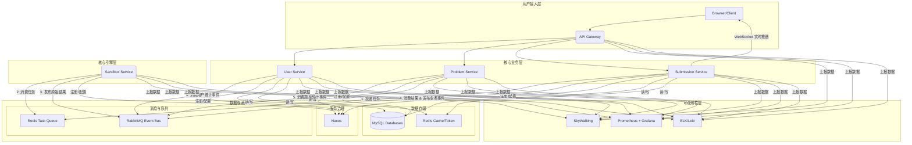
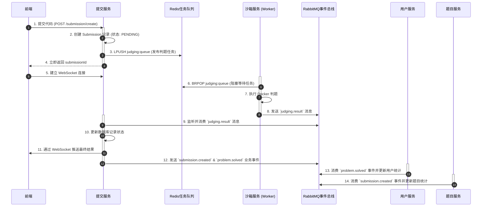
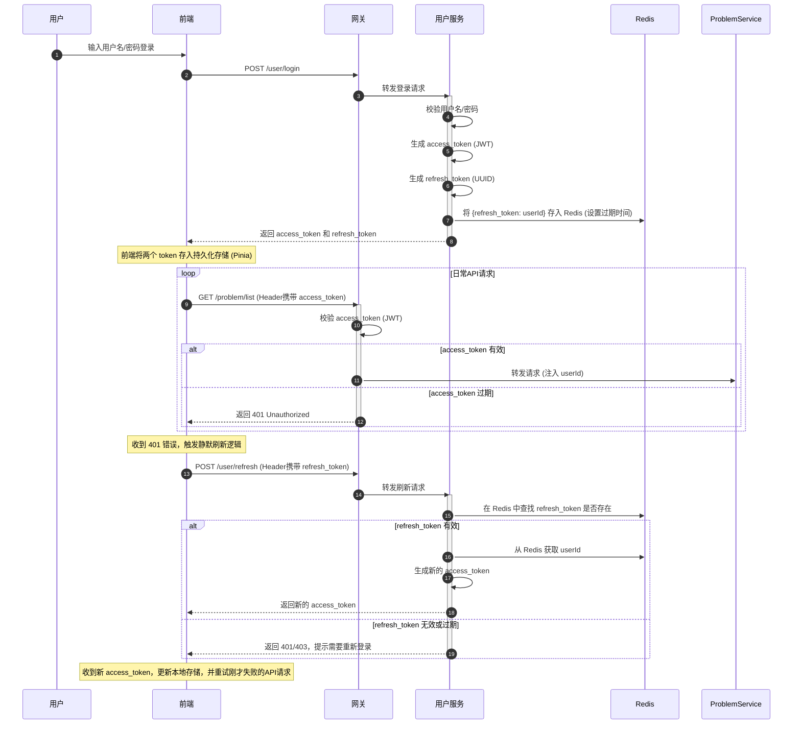
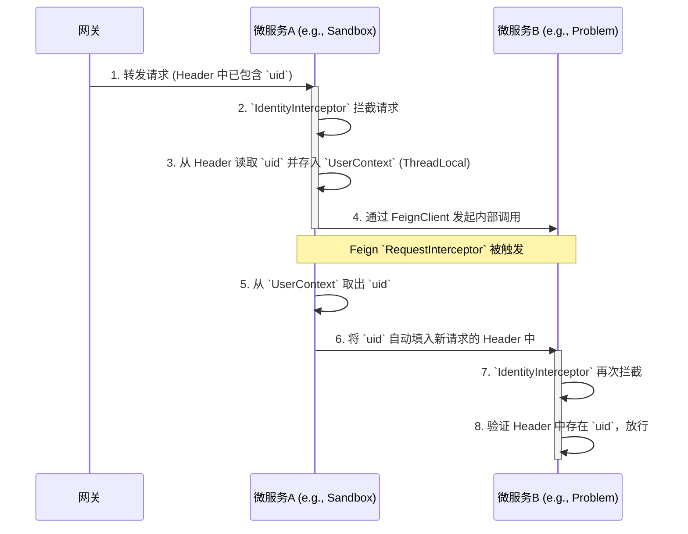
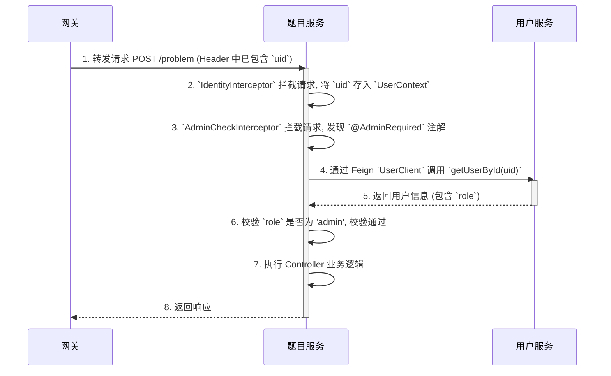
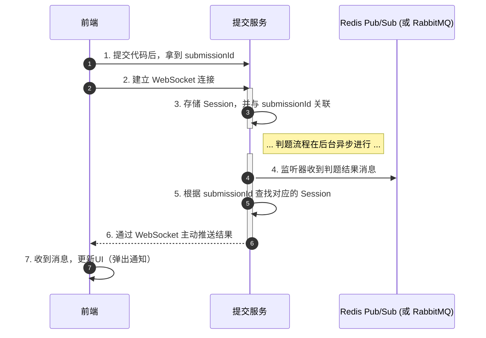
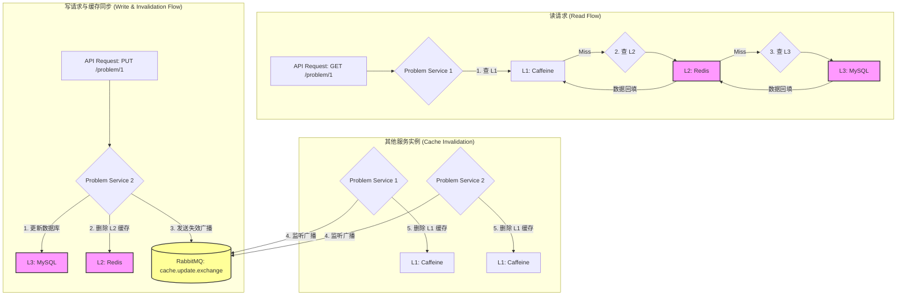

# D-OnlineJudge: 技术选型与架构设计 (v2.0)

本文档阐述 D-OnlineJudge 项目为实现高性能、高可用、高扩展性目标而设计的核心技术体系与架构亮点。

---

## 1. 升级版架构蓝图

为应对复杂的业务场景和未来的技术挑战，D-OnlineJudge 的后端架构演进为一套集流量治理、异步通信、全链路可观测性于一体的现代化微服务体系。



---

## 2. 核心架构亮点

### 亮点一：统一API网关与智能治理中心

API网关 (`gateway-service`) 不再仅仅是请求的“中转站”，而是通过深度集成 **Alibaba Sentinel**，升级为系统的“**流量治理与安全中枢**”，为整个后端服务集群提供了强大的保护能力。

- **统一入口与路由**: 所有外部请求的唯一入口，基于路径将流量精确分发至下游服务。
- **安全屏障**: 
    - **企业级认证**: 采用**长短令牌（Refresh/Access Token）机制**，通过网关层的全局过滤器（GlobalFilter）高效校验短令牌 `access_token`。
    - **服务访问控制**: 在各微服务中配置拦截器，强制要求所有请求必须包含源自网关的特定标识，杜绝了内网环境下的服务横向穿透风险。

- **流量智能治理 (Sentinel)**: 
    - **流量控制 (Flow Control)**: 我们为核心接口配置了精细化的 QPS（每秒查询率）限流规则。例如，为防止高频“刷题”，对“获取题目详情”接口 (`/problem/{id}`) 设置了“10次/分钟”的访问限制。这是通过将 QPS 设置为1，并配合“排队等待”的流控效果（等待超时6秒）来实现的，既能精确控制频率，又能缓冲用户的正常突发请求，体验更平滑。
    - **熔断降级 (Circuit Breaking)**: 我们为所有跨服务的调用配置了基于“慢调用比例”的熔断规则。例如，当对 `user-service` 的调用响应时间超过预设阈值（如200ms）的比例过高时，网关会自动“熔断”对此服务的新请求，在一段时间内直接返回友好错误，而不是让大量请求堆积、超时。这能有效防止单个下游服务的故障或性能下降，通过“雪崩效应”拖垮整个系统，极大地提升了系统的健壮性。
    - **动态与持久化**: 所有 Sentinel 规则都存储在 **Nacos** 中，网关服务在启动时会自动拉取，并能动态监听其变更。这使得运维人员可以在不重启服务的情况下，通过 Nacos 控制台实时调整流控和熔断策略。

### 亮点二：混合消息模式：Redis任务队列与RabbitMQ事件总线

为了同时满足判题任务的“高性能分发”和业务事件的“可靠广播”这两种不同需求，我们采用了一套优雅的混合消息架构，充分利用了 Redis 和 RabbitMQ 各自的优势。

- **Redis List 作为任务队列**: 对于判题任务的分发，我们追求的是极致的低延迟和高吞吐。Redis 基于内存的 `LPUSH` / `BRPOP` 命令提供了完美的轻量级任务队列实现，使得 `sandbox-service` 的提交接口可以瞬时响应。
- **RabbitMQ 作为事件总线**: 对于判题完成后的状态变更，这属于业务领域的事件。我们使用 RabbitMQ 强大的 Topic 交换机来广播这些事件（如 `submission.created`, `problem.solved`），未来任何对这些事件感兴趣的下游服务（如统计服务、徽章服务等）都可以灵活地订阅，实现了真正的事件驱动和微服务解耦。



### 亮点三：企业级认证与分布式缓存中心

我们引入 **Redis** 作为核心的内存数据中间件，并升级了认证体系，实现了高性能与高安全性的统一。

#### 认证与刷新流程



- **长短令牌机制**:
    - **`access_token` (JWT)**: 短时效、无状态，用于API请求，包含用户的角色权限信息，由网关进行快速验证。
    - **`refresh_token`**: 长时效、有状态，存储在 **Redis** 中。用于在`access_token`过期后，安全地换取新的令牌，实现了用户的无感续期和强制下线等高级功能。
- **分布式高速缓存**: 
    - **热点数据缓存**: 将频繁访问且不常变化的数据，如用户信息、题目详情、热门排行榜等，缓存在Redis中，大幅降低数据库的读取压力。
    - **分布式锁**: 利用Redis实现分布式锁，解决在集群环境下更新题目通过数、用户积分等场景下的并发安全问题。

### 亮点四：优雅的认证与用户上下文传递

在微服务架构中，如何安全、无感地将用户的身份信息（如 User ID）在服务调用链中传递，是一个核心问题。本项目采用了一套“网关注入 -> 线程内缓存 -> Feign自动填充 -> 权限校验”的优雅方案。





- **网关层统一注入**: 所有外部请求经网关认证后，用户的 `userId` 被解析并放入请求头，作为身份标识的唯一来源。
- **线程内上下文 (`ThreadLocal`)**: 每个业务微服务都配置了一个 `IdentityInterceptor`。它在处理每个请求的开始，从请求头中读取 `userId` 并存入一个 `ThreadLocal` 变量 (`UserContext`) 中。这使得在当前请求的处理线程中，任何地方的业务代码都可以方便地通过 `UserContext.getCurrentUser()` 获取当前用户ID，而无需在方法参数中层层传递。
- **Feign 自动填充**: 为了解决服务间调用时 `ThreadLocal` 信息丢失的问题，我们配置了一个全局的 Feign `RequestInterceptor`。它会在每一次 Feign 调用发起前，自动从 `UserContext` 中获取 `userId`，并将其添加到新的 HTTP 请求头中。这确保了用户身份在整个微服务调用链中能够无缝、安全地传递下去。

#### 扩展：管理员权限校验

基于以上用户上下文传递机制，我们构建了一套非侵入式的管理员权限校验方案。

- **`@AdminRequired` 注解**: 我们创建了一个自定义注解，只需将其标记在任何需要管理员权限的 Controller 方法上即可。
- **`AdminCheckInterceptor`**: 我们创建了第二个拦截器，它会在 `IdentityInterceptor` 之后执行。如果检测到方法上的 `@AdminRequired` 注解，它就会通过 `UserContext` 获取用户ID，然后通过 Feign 客户端 `UserClient` 回调 `user-service` 获取该用户的角色。如果角色不是 `admin`，则直接抛出 `ForbiddenException`，请求被终止并返回 403 错误。
- **依赖注入与启动**: 通过在每个微服务的主启动类上使用 `@Import({..., AdminCheckInterceptor.class})`，我们确保了该拦截器作为一个 Bean 被 Spring 容器管理，从而解决了因 Feign 客户端初始化而可能导致的循环依赖问题。

### 亮点五：全局 WebSocket 实时通知

为了在异步判题架构下，向用户提供优雅、无干扰的实时结果反馈，我们构建了一套全局的 WebSocket 通知系统，取代了需要用户停留在当前页面的传统方案。



- **全局服务化**: 我们将 WebSocket 的所有连接管理、消息监听和处理逻辑，都封装在一个独立的、全局可用的服务 (`src/utils/websocket.ts`) 中。该服务在应用根组件 (`App.vue`) 挂载时被初始化，确保了其生命周期与整个应用保持一致。

- **按需订阅**: 用户在提交代码后，前端会调用 `useWebSocket().subscribeToSubmission(submissionId)` 方法。该方法会通过已建立的全局 WebSocket 连接，向后端发送一条“订阅”消息，将当前会话与本次提交的 `submissionId` 关联起来。

- **非阻塞式富文本通知**: 当后端判题完成，并通过 WebSocket 推送结果时，前端的全局监听器会捕获到该消息。它并不会粗暴地打断用户的当前操作，而是调用 Element Plus 的 `ElNotification` 组件，在屏幕的右下角弹出一个内容丰富的通知卡片。我们利用 Vue 的 `h` 函数（渲染函数）来动态构建通知的 `message`，使其可以包含状态、耗时、内存、错误信息等复杂的 HTML 结构。

- **可交互与自动关闭**: 该通知卡片在显示一段时间后会自动消失，用户也可以点击它，页面会自动跳转到对应的提交详情页，实现了从“收到结果”到“查看详情”的无缝体验。

### 亮点六：高性能三级缓存架构 (L1+L2+DB)

对于“题目详情”这类访问频率极高、但内容不常变更的“热点数据”，我们设计并实现了一套“本地缓存 + 分布式缓存 + 数据库”的三级缓存架构，最大限度地降低了数据库压力，将查询性能提升至极致。



- **L1 本地缓存 (Caffeine)**: 速度最快的内存级缓存。对于短时间内对同一个题目的重复请求，将直接在纳秒级从内存返回，无需任何网络开销。
- **L2 分布式缓存 (Redis)**: 速度很快的集中式缓存。当 L1 缓存未命中时（例如，服务实例首次访问该数据），会查询 Redis。这避免了对数据库的直接访问，并且缓存结果由所有 `problem-service` 实例共享。
- **L3 数据源 (MySQL)**: 最终的数据保障，只有当 L1 和 L2 缓存都未命中时，才会查询数据库。

#### 核心查询流程与场景

1.  **L1 命中 (理想情况)**: 请求直接由本地内存返回，性能最佳。
2.  **L2 命中 (跨实例协同)**: L1 未命中，但从 Redis 中获取到数据。数据会**回填**到 L1 缓存中，以便下一次访问能直接命中 L1。
3.  **L1 & L2 均失效 (缓存穿透/冷启动)**: 缓存中无数据，查询将穿透到数据库。查询成功后，数据会**依次写回**到 L2 (Redis) 和 L1 (Caffeine) 中，完成缓存的预热。

#### 缓存一致性保证

当题目信息被更新或删除时，为了保证数据一致性，我们采用“**L2 缓存淘汰 + MQ 广播**”的策略：
1.  服务实例在完成数据库操作后，立即删除 Redis 中的 L2 缓存。
2.  同时，向 RabbitMQ 的一个 Fanout 交换机（广播模式）发送一条“缓存失效”消息。
3.  所有 `problem-service` 实例（包括操作者自身）都会监听到这条消息，并各自删除自己内存中的 L1 缓存。这确保了所有实例的本地缓存在短时间内都能达到最终一致性。

### 亮点七：全链路可观测性体系 (The Three Pillars)

在复杂的微服务环境中，快速定位问题和分析性能瓶颈是巨大的挑战。为此，我们构建了覆盖“日志、追踪、监控”三大黄金指标的全链路可观测性体系，让系统的内部状态不再是“黑盒”。

| 支柱 | 技术选型 | 核心作用 (回答的问题) |
| :--- | :--- | :--- |
| **日志 (Logs)** | **ELK / Loki** | **“发生了什么？”** - 提供离散的、具体的事件记录。 |
| **指标 (Metrics)** | **Prometheus + Grafana** | - **立体化监控与告警 (Prometheus + Grafana)**|
| **追踪 (Traces)** | **Apache SkyWalking** | **“请求经历了什么？”** - 串联单次请求在多个服务间的完整调用路径和耗时。 |

- **日志聚合 (Loki)**:
    - **日志采集 (`Promtail`)**: 我们部署了 Promtail 作为日志采集代理。它通过 Docker 服务发现，能自动找到所有正在运行的微服务容器，并抓取它们的标准输出（stdout）日志。
    - **日志存储与查询 (`Loki`)**: Promtail 将采集到的日志流打上标签（如 `container="/user-service"`）后，发送给 Loki 进行存储。Loki 只对标签进行索引，而不是对日志内容进行全文索引，这使得它极其轻量且存储成本极低。
    - **查询与关联 (`Grafana`)**: 在 Grafana 中，我们可以使用 LogQL（一种类似 PromQL 的查询语言）来高效地搜索和过滤日志，例如 `{container="/problem-service"} |= "ERROR"`。更强大的是，我们可以通过 SkyWalking 的 TraceID，在 Grafana 中一键从 Trace 视图跳转到相关的日志，实现链路与日志的无缝关联，极大提升了分布式系统的排障效率。

- **指标暴露 (`Actuator`)**: 每个微服务都集成了 Spring Boot Actuator 和 Micrometer，通过 `/actuator/prometheus` 端点，以 Prometheus 要求的格式，暴露出海量的、涵盖 JVM、HTTP 请求、连接池等多个维度的核心指标。
- **指标采集 (`Prometheus`)**: 我们部署了 Prometheus 服务，并配置其通过 Nacos 进行服务发现。这使得 Prometheus 能够自动找到所有在线的微服务实例，并定期从它们的指标端点“抓取”(Scrape) 数据，存入其内置的时序数据库中。
- **数据可视化 (`Grafana`)**: 我们使用 Grafana 作为统一的可视化平台。通过配置 Prometheus 为数据源，我们可以使用强大的 PromQL 查询语言（例如，`sum(rate(http_server_requests_seconds_count{job="doj-services"}[1m])) by (service)`）来聚合和分析指标，并创建包含折线图、仪表盘、告警规则的专业监控大盘。

#### SkyWalking：分布式系统的“GPS导航”

在三大支柱中，SkyWalking 扮演着不可或缺的“GPS导航”角色。当一个请求变慢或出错时，日志只能告诉我们某个服务报错了，监控指标只能告诉我们某个服务的CPU升高了，但只有**链路追踪**能清晰地告诉我们：

-   这个请求从网关开始，依次经过了哪些服务？
-   在每个服务内部，它调用了哪些方法、访问了哪个数据库？
-   整个调用链条中，到底是**哪一环**花费了最长的时间，或者**哪一环**最先抛出了异常？

**实现原理**: 我们通过 `-javaagent` 的方式，为每个微服务无侵入式地挂载了 SkyWalking 的探针。该探针会自动拦截所有进出的 HTTP 请求、JDBC 调用、MQ 消息等，并生成和传递一个全局唯一的 `TraceID`，最终将整条调用链的数据上报给 SkyWalking OAP 服务器进行分析和存储。

### 亮点八：自动化CI/CD流水线 (GitHub Actions)

为了实现快速、可靠、一致的软件交付，我们基于 GitHub Actions 构建了一套完整的自动化 CI/CD (持续集成/持续部署) 流水线。开发者只需将代码推送到 `main` 分支，后续的测试、构建、打包、推送镜像、服务器部署等所有繁琐的流程都将自动完成。

- **并行构建 (`Matrix Strategy`)**: 流水线利用 GitHub Actions 的 `strategy.matrix` 特性，为每一个微服务（`user-service`, `problem-service` 等）创建一个独立的构建任务。这些任务在云端并行执行，极大地缩短了所有服务的总构建时间。

- **优化的多阶段构建 (`Dockerfile`)**: 我们为每个微服务都编写了优化的多阶段 `Dockerfile`。在“构建阶段”，使用包含完整 Maven 环境的镜像来编译代码和下载依赖；在“运行阶段”，仅将编译好的 `.jar` 文件复制到一个轻量的 JRE 镜像中。这使得最终生成的生产镜像体积最小化，并能充分利用 Docker 的构建缓存机制，提升后续构建的速度。

- **职责分离的 Jobs (`build-and-push` & `deploy`)**:
    1.  **`build-and-push` Job**: 负责编译所有代码，构建所有微服务的 Docker 镜像，并将其推送到 Docker Hub 镜像仓库进行统一的版本管理。
    2.  **`deploy` Job**: 该任务依赖于 `build-and-push` 的成功。它会通过 SSH 安全地连接到生产服务器，执行预设的部署脚本，自动拉取最新的镜像并以 `docker-compose` 的方式重启所有服务，完成部署的“最后一公里”。

通过这套流水线，我们实现了从“代码提交”到“服务上线”的全流程自动化，确保了每次部署都是可重复、可预测和高度可靠的。

#### 实际应用场景与查询指南

**场景**: 用户反馈“提交代码后，页面卡了很久才显示结果”。

**如何使用 SkyWalking 排查？**

1.  **定位慢请求**: 打开 SkyWalking UI (`http://localhost:9999`)，进入“追踪”页面。通过服务名称 (`gateway-service`)、接口路径 (`/submission/create`) 或设置最小耗时，筛选出那些响应缓慢的请求记录。

2.  **分析链路拓扑**: 点击一条慢请求的追踪记录，您会看到一个清晰的**火焰图或列表**，它展示了该请求从 `gateway-service` 开始，到 `submission-service`，再到 `sandbox-service` 的完整调用过程。

    ```
    gateway-service  (2010ms)
    └── submission-service (2005ms)
        ├── (DB) INSERT ... (5ms)
        ├── (Redis) LPUSH ... (1ms)
        └── (Feign) POST /sandbox/validate (2000ms)  <-- 发现瓶颈！
            └── sandbox-service (1998ms)
                └── ...
    ```

3.  **发现根因**: 从上图可以一目了然地发现，整个请求的耗时主要集中在 `submission-service` 对 `sandbox-service` 的 Feign 调用上。这立刻将我们的排查范围缩小到了 `sandbox-service` 内部，而不是去怀疑数据库或 Redis。这正是链路追踪的巨大价值所在。

---

## 附录：关键技术与设计决策

### 1. 全局统一异常处理

为了避免在每个 Controller 方法中都使用 `try-catch` 来处理异常，并向前端返回统一、规范的错误格式，项目采用了 Spring 的全局异常处理机制。

- **实现**: 通过创建一个带有 `@RestControllerAdvice` 注解的类，并为不同类型的异常（如我们自定义的 `BadRequestException`, `UnauthorizedException`，以及通用的 `Exception`）编写被 `@ExceptionHandler` 注解标记的方法。
- **优势**: 所有的业务异常都会被这个切面捕获，并被统一包装成 JSON 格式返回给前端。这极大地简化了业务代码，并保证了 API 错误响应的一致性。

### 2. 双配置文件启动模型 (`bootstrap` vs `application`)

在 Spring Cloud 环境中，我们为每个微服务都配置了 `bootstrap.yaml` 和 `application.yaml` 两个文件，它们在应用启动时有不同的加载时机和用途。

- **`bootstrap.yaml` (引导上下文)**:
    - **加载时机**: **优先于** `application.yaml` 加载。
    - **核心用途**: 主要用于存放那些需要**引导应用、发现配置中心**的配置。在本项目中，它只存放两项最关键的信息：
        1.  `spring.application.name`: 应用的名称，用于服务注册和配置拉取。
        2.  `spring.cloud.nacos.server-addr`: Nacos 服务器的地址。
    - **工作流程**: Spring Cloud 应用启动时，会先创建一个“引导上下文”，加载 `bootstrap.yaml`。通过这里面的配置，它知道了自己是谁、要去哪里找配置中心。然后，它会去 Nacos 拉取所有共享和私有的配置。

- **`application.yaml` (应用上下文)**:
    - **加载时机**: 在 `bootstrap` 阶段**之后**加载。
    - **核心用途**: 用于存放应用的**常规业务配置**，例如服务器端口 (`server.port`)、数据库地址、Swagger 扫描路径等。这些配置的值可以被 Nacos 中的同名配置所覆盖。

通过这种分离，我们确保了应用能够先找到“大本营”（Nacos），然后再从“大本营”获取详细的“作战计划”（业务配置），流程清晰且可靠。
