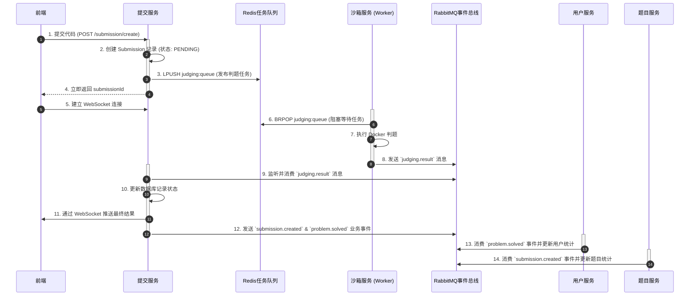
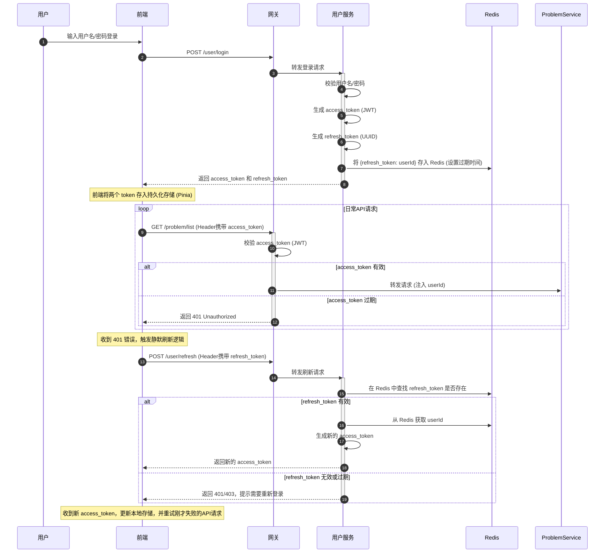

# D-OnlineJudge: 技术选型与架构设计 (v2.0)

本文档阐述 D-OnlineJudge 项目为实现高性能、高可用、高扩展性目标而设计的核心技术体系与架构亮点。

---

## 1. 升级版架构蓝图

为应对复杂的业务场景和未来的技术挑战，D-OnlineJudge 的后端架构演进为一套集流量治理、异步通信、全链路可观测性于一体的现代化微服务体系。

```mermaid
graph TD
    subgraph "用户端"
        A[Browser/Client]
    end

    subgraph "流量入口与治理"
        B(API Gateway)
        B -- 限流/熔断 --> C(Sentinel Dashboard)
    end

    subgraph "核心业务服务 (Spring Cloud)"
        direction LR
        D(User Service)
        E(Problem Service)
        F(Submission Service)
    end

    subgraph "核心中间件"
        direction TB
        G[Nacos]
        H[Redis (缓存/令牌)]
        I[Redis (任务队列)]
        J[RabbitMQ (事件总线)]
    end

    subgraph "判题引擎"
        K(Sandbox Service)
    end

    subgraph "可观测性平台"
        direction LR
        L[SkyWalking]
        M[Prometheus + Grafana]
        N[ELK/Loki]
    end

    A -- HTTP/HTTPS --> B
    B -- 路由/鉴权 --> D
    B -- 路由/鉴权 --> E
    B -- 路由/鉴权 --> F

    D & E & F & K -- 服务注册/发现/配置 --> G
    D & F -- 读写缓存/令牌 --> H
    F -- 投递判题任务 --> I
    K -- 消费判题任务 --> I
    K -- 发布判题结果 --> J
    F -- 消费判题结果 & 发布业务事件 --> J
    D & E -- 消费业务事件 --> J

    F -- WebSocket --> A

    D & E & F & K & B -- 链路追踪 --> L
    D & E & F & K & B -- 指标监控 --> M
    D & E & F & K & B -- 日志汇聚 --> N
```

---

## 2. 核心架构亮点

### 亮点一：统一API网关与智能治理中心

API网关 (`gateway-service`) 不再仅仅是请求的“中转站”，而是升级为系统的“**流量治理与安全中枢**”。

- **统一入口与路由**: 所有外部请求的唯一入口，基于路径将流量精确分发至下游服务。
- **安全屏障**: 
    - **企业级认证**: 采用**长短令牌（Refresh/Access Token）机制**，通过网关层的全局过滤器（GlobalFilter）高效校验短令牌 `access_token`。
    - **服务访问控制**: 在各微服务中配置拦截器，强制要求所有请求必须包含源自网关的特定标识，杜绝了内网环境下的服务横向穿透风险。
- **流量智能治理**: 
    - **动态流量控制**: 集成 **Alibaba Sentinel**，在网关层实现精细化的流量控制，如QPS限制、线程数限制，有效防止恶意请求冲垮后端服务。
    - **熔断与降级**: 对下游服务的调用进行实时监控，当某个服务出现高延迟或频繁错误时，能自动进行熔断，并返回预设的友好响应，防止雪崩效应，保证核心功能的可用性。

### 亮点二：混合消息模式：Redis任务队列与RabbitMQ事件总线

为了同时满足判题任务的“高性能分发”和业务事件的“可靠广播”这两种不同需求，我们采用了一套优雅的混合消息架构，充分利用了 Redis 和 RabbitMQ 各自的优势。

- **Redis List 作为任务队列**: 对于判题任务的分发，我们追求的是极致的低延迟和高吞吐。Redis 基于内存的 `LPUSH` / `BRPOP` 命令提供了完美的轻量级任务队列实现，使得 `sandbox-service` 的提交接口可以瞬时响应。
- **RabbitMQ 作为事件总线**: 对于判题完成后的状态变更，这属于业务领域的事件。我们使用 RabbitMQ 强大的 Topic 交换机来广播这些事件（如 `submission.created`, `problem.solved`），未来任何对这些事件感兴趣的下游服务（如统计服务、徽章服务等）都可以灵活地订阅，实现了真正的事件驱动和微服务解耦。



### 亮点三：企业级认证与分布式缓存中心

我们引入 **Redis** 作为核心的内存数据中间件，并升级了认证体系，实现了高性能与高安全性的统一。

#### 认证与刷新流程



- **长短令牌机制**:
    - **`access_token` (JWT)**: 短时效、无状态，用于API请求，包含用户的角色权限信息，由网关进行快速验证。
    - **`refresh_token`**: 长时效、有状态，存储在 **Redis** 中。用于在`access_token`过期后，安全地换取新的令牌，实现了用户的无感续期和强制下线等高级功能。
- **分布式高速缓存**: 
    - **热点数据缓存**: 将频繁访问且不常变化的数据，如用户信息、题目详情、热门排行榜等，缓存在Redis中，大幅降低数据库的读取压力。
    - **分布式锁**: 利用Redis实现分布式锁，解决在集群环境下更新题目通过数、用户积分等场景下的并发安全问题。

### 亮点四：全链路可观测性体系

为了在复杂的微服务环境中快速定位问题、分析性能，我们构建了覆盖“日志、追踪、监控”三大黄金指标的全链路可观测性体系。

- **分布式日志 (ELK / Loki)**: 所有微服务的日志被实时收集、聚合到统一的日志中心，开发者可以通过图形化界面，一站式地搜索和分析所有服务的日志，告别逐台服务器捞日志的原始方式。
- **分布式链路追踪 (Apache SkyWalking)**: 通过字节码注入或Agent技术，自动将一个用户请求在所有微服务间的调用过程串联成一条完整的调用链。当请求变慢或出错时，能一目了然地看到瓶颈或故障发生在哪个服务的哪个环节。
- **立体化监控与告警 (Prometheus + Grafana)**: 
    - **指标采集**: 各微服务通过Actuator暴露丰富的运行时指标（JVM、线程池、连接池、API延迟等）。
    - **数据可视化**: Prometheus负责周期性地抓取并存储这些指标，Grafana则提供了强大的仪表盘功能，将枯燥的数据转化为直观的图表，实现对系统健康状况的实时监控。
    - **智能告警**: 在Grafana中可以配置灵活的告警规则，当系统指标异常时，能通过邮件、钉钉等多种渠道及时通知开发人员。

---

## 3. 架构升级与演进计划

为实现上述架构蓝图，我们制定了清晰的演进计划。后续的开发工作将围绕以下核心任务展开：

- **[ ] 中间件集成**
    - [x] **集成 Redis**: 用于实现长短令牌存储和分布式缓存。
    - [x] **集成 Message Queue (RabbitMQ/RocketMQ)**: 重构判题流程，实现服务间的异步解耦。
    - [ ] **集成 Sentinel**: 在网关层实现流量控制与熔断降级。

- **[ ] 实时通信**
    - [ ] **实现 WebSocket 服务**: 用于向前端实时推送判题结果。

- **[ ] 可观测性建设**
    - [ ] **集成 SkyWalking**: 搭建分布式链路追踪系统。
    - [ ] **部署 Prometheus & Grafana**: 建立统一的指标监控与告警平台。
    - [ ] **部署 ELK 或 Loki**: 建立集中式的日志管理系统。

- **[ ] 自动化运维**
    - [ ] **建立 CI/CD 流水线**: 使用 Jenkins 或 GitHub Actions 自动化项目的测试、构建和部署流程。