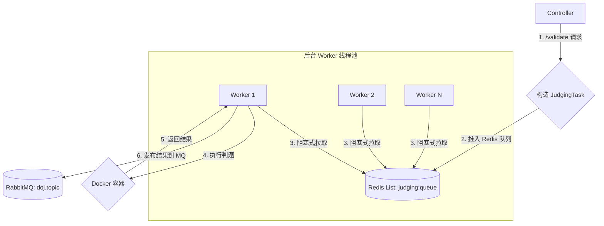

# Sandbox-Service: 异步判题引擎

`sandbox-service` 是 D-OnlineJudge 的核心计算单元，它不再作为传统的 HTTP 服务存在，而是被设计成一个高性能、可水平扩展的**异步任务处理引擎**。

---

## 1. 架构角色

`sandbox-service` 在新的架构中扮演两个角色：

1.  **HTTP 接口提供者 (用于即时运行)**: 它保留了 `/code` 和 `/problem` 两个端点，用于处理需要立即返回结果的临时代码运行请求。这部分逻辑通过 `@Async` 注解在独立的线程池中执行，以避免阻塞 API 线程。

2.  **分布式任务消费者 (用于提交验证)**: 这是它的核心职责。服务在启动后，会创建多个后台 **Worker 线程**，持续地从 Redis 的 `judging:queue` 任务队列中拉取判题任务并执行。

---

## 2. 核心工作流程 (异步验证)

1.  **任务投递**: `SandboxController` 的 `/validate` 接口接收到请求后，仅负责创建 `Submission` 记录并获取 `submissionId`，然后将包含所有判题信息的 `JudgingTask` 对象推入 Redis 列表，并立即返回 `submissionId`。
2.  **任务消费**: `JudgingWorker` 类在应用启动时，会根据配置（`doj.sandbox.worker-threads`）创建多个后台线程。每个线程都通过 `BRPOP` 命令阻塞式地等待任务队列。
3.  **任务执行**: Worker 线程一旦获取到任务，就会调用同步的 `JudgingServiceImpl` 来执行完整的判题逻辑，包括创建临时文件、调用 Docker、解析结果等。
4.  **结果广播**: 判题完成后，`JudgingServiceImpl` 会将包含 `submissionId` 和判题结果的消息，通过 `RabbitTemplate` 发送到 `doj.topic` 交换机，路由键为 `judging.result`。

---

## 3. 优势

- **高吞吐量**: 提交接口（`/validate`）的响应时间被降至最低，因为它只执行一次远程调用和一次 Redis `LPUSH` 操作。
- **可扩展性**: 当判题任务积压时，只需水平扩展 `sandbox-service` 的实例数量，新的实例会自动加入到消费者的行列中，共同处理任务，判题能力可以线性增长。
- **高可用性**: 即使所有 `sandbox-service` 实例都宕机，未处理的判题任务依然安全地存储在 Redis 队列中，等待服务恢复后继续执行。