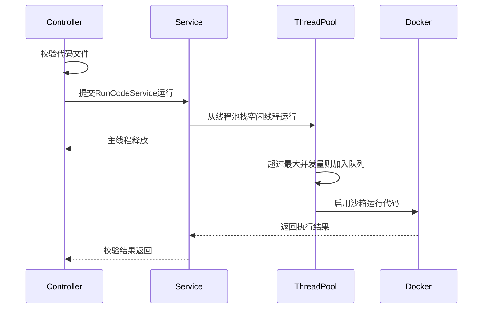

## 基础架构

利用**docker**模拟代码沙箱，每次执行代码都会新开一个沙箱环境安全运行。



## Docker环境准备

> 现在只支持cpp，java和python三种语言

### cpp

```dockerfile
FROM gcc:10.5.0-bullseye

# 安装必要工具用于统计资源
RUN apt-get update && apt-get install -y time && apt-get clean

WORKDIR /app

# 默认 ENTRYPOINT，用于执行你传进来的命令（语言、超时都交给外部决定）
ENTRYPOINT ["/bin/bash", "-c"]
```

### java

```dockerfile
FROM openjdk:17-slim

# 安装必要工具用于统计资源
RUN apt-get update && apt-get install -y time && apt-get clean

WORKDIR /app

# 默认 ENTRYPOINT，用于执行你传进来的命令（语言、超时都交给外部决定）
ENTRYPOINT ["/bin/bash", "-c"]
```

### python

```dockerfile
FROM python:3.10-slim

# 安装必要工具用于统计资源
RUN apt-get update && apt-get install -y time && apt-get clean

WORKDIR /app

# 默认 ENTRYPOINT，用于执行你传进来的命令（语言、超时都交给外部决定）
ENTRYPOINT ["/bin/bash", "-c"]
```

然后将这几个dockerfile编译成本地镜像：

```bash
docker build -t code-runner-cpp -f Dockerfile.cppc .
```

## 无输入代码执行

```sh
docker run --rm -v $(pwd):/app --memory 128m code-runner-cpp \
"/usr/bin/time -v timeout 5s sh -c 'g++ -std=c++17 Main.cpp -o Main && ./Main'"
```

```sh
docker run --rm -v $(pwd):/app --memory 128m code-runner-java \
"/usr/bin/time -v timeout 2s sh -c 'javac Main.java && java Main'"
```

```sh
docker run --rm -v $(pwd):/app --memory 128m code-runner-python \
"/usr/bin/time -v timeout 2s python3 Main.py"
```

`$(pwd):/app`：将主机当前目录内容挂载到docker运行目录/app中。

`/usr/bin/time -v timeout 5s`：命令行层面控制代码执行时间

`--memory 128m`：docker层面限制代码执行内存

